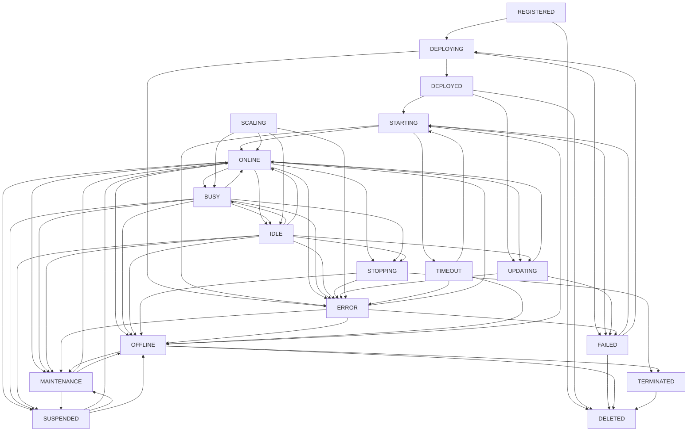

# Agent Lifecycle Management System

## Overview

The Agent Lifecycle Management System provides comprehensive state management and lifecycle operations for DevCycle AI agents. This system handles the complete lifecycle of agents from registration to termination, including state transitions, event handling, and lifecycle operations.

## Architecture

### Core Components

1. **AgentLifecycleState**: Enum defining all possible agent states
2. **AgentLifecycleManager**: Manages individual agent lifecycle and state transitions
3. **AgentLifecycleService**: High-level service for managing multiple agents
4. **AgentStateTransition**: Model for recording state transitions
5. **AgentLifecycleEvent**: Model for lifecycle events

### State Machine

The system implements a comprehensive state machine with 18 distinct states:

#### Initial States
- **REGISTERED**: Agent registered but not deployed
- **DEPLOYING**: Agent being deployed
- **DEPLOYED**: Agent deployed but not active

#### Active States
- **STARTING**: Agent starting up
- **ONLINE**: Agent online and ready
- **BUSY**: Agent processing tasks
- **IDLE**: Agent online but no active tasks

#### Transitional States
- **STOPPING**: Agent shutting down
- **UPDATING**: Agent being updated
- **SCALING**: Agent being scaled

#### Error States
- **ERROR**: Agent in error state
- **FAILED**: Agent failed to start/operate
- **TIMEOUT**: Agent timeout

#### Maintenance States
- **MAINTENANCE**: Agent in maintenance mode
- **SUSPENDED**: Agent suspended
- **OFFLINE**: Agent offline

#### Final States
- **TERMINATED**: Agent terminated
- **DELETED**: Agent deleted

## State Transitions

### Valid Transitions

The system enforces strict state transition rules to ensure agents follow valid lifecycle paths:



## Usage Examples

### Basic Lifecycle Management

```python
from devcycle.core.agents.lifecycle import AgentLifecycleService
from uuid import uuid4

# Initialize service
service = AgentLifecycleService()
agent_id = uuid4()

# Register agent
await service.register_agent(agent_id)

# Deploy agent
await service.deploy_agent(agent_id)

# Start agent
await service.start_agent(agent_id)

# Assign task
await service.assign_task(agent_id)

# Complete task
await service.complete_task(agent_id)

# Stop agent
await service.stop_agent(agent_id)
```

### Advanced State Management

```python
from devcycle.core.agents.lifecycle import AgentLifecycleManager, AgentLifecycleState

# Get lifecycle manager
manager = service.get_manager(agent_id)

# Check if transition is valid
if manager.can_transition_to(AgentLifecycleState.MAINTENANCE):
    await manager.transition_to(
        AgentLifecycleState.MAINTENANCE,
        reason="Scheduled maintenance",
        triggered_by="admin",
        metadata={"maintenance_window": "2024-01-01T02:00:00Z"}
    )

# Get current state info
state_info = manager.get_current_state_info()
print(f"Current state: {state_info['current_state']}")
print(f"Valid transitions: {state_info['valid_transitions']}")

# Check agent status
if manager.is_operational():
    print("Agent is operational")
if manager.is_available_for_tasks():
    print("Agent can accept new tasks")
if manager.is_in_error_state():
    print("Agent is in error state")
```

### Event Handling

```python
# Register event handlers
def on_state_change(event_type, data):
    print(f"Event: {event_type}, Data: {data}")

manager.on_event("pre_transition", on_state_change)
manager.on_event("post_transition", on_state_change)

# Async event handler
async def async_handler(event_type, data):
    await process_event(event_type, data)

manager.on_event("pre_transition", async_handler)
```

### Service Operations

```python
# Get all agent statuses
all_statuses = service.get_all_agent_statuses()

# Get operational agents
operational_agents = service.get_operational_agents()

# Get available agents
available_agents = service.get_available_agents()

# Get agents in error
error_agents = service.get_agents_in_error()

# Get agents in maintenance
maintenance_agents = service.get_agents_in_maintenance()

# Handle agent error
await service.handle_error(agent_id, "Network timeout")

# Put agent in maintenance
await service.put_in_maintenance(agent_id, "Scheduled maintenance")

# Resume from maintenance
await service.resume_from_maintenance(agent_id)
```

## Integration with Existing System

### Database Models

The lifecycle system integrates with existing agent database models:

```python
# AgentStatus enum updated to include all lifecycle states
class AgentStatus(str, Enum):
    # Core operational states
    OFFLINE = "offline"
    ONLINE = "online"
    BUSY = "busy"
    IDLE = "idle"
    ERROR = "error"
    MAINTENANCE = "maintenance"

    # Lifecycle states
    REGISTERED = "registered"
    DEPLOYING = "deploying"
    DEPLOYED = "deployed"
    STARTING = "starting"
    STOPPING = "stopping"
    UPDATING = "updating"
    SCALING = "scaling"
    FAILED = "failed"
    TIMEOUT = "timeout"
    SUSPENDED = "suspended"
    TERMINATED = "terminated"
    DELETED = "deleted"
```

### Pydantic Models

New Pydantic models for lifecycle management:

```python
class AgentLifecycleState(BaseModel):
    """Agent lifecycle state model."""
    state: AgentStatus
    timestamp: datetime
    reason: str
    triggered_by: str
    metadata: Dict[str, Any] = {}

class AgentLifecycleHistory(BaseModel):
    """Agent lifecycle history model."""
    agent_id: UUID
    states: List[AgentLifecycleState]
    current_state: AgentStatus
    is_operational: bool
    is_available_for_tasks: bool
    is_in_error_state: bool
    is_in_maintenance: bool
```

## Hugging Face Integration

The lifecycle system is designed to work seamlessly with Hugging Face Spaces:

### HF Space Lifecycle Mapping

```python
# HF Space states map to lifecycle states
HF_SPACE_STATES = {
    "building": AgentLifecycleState.DEPLOYING,
    "running": AgentLifecycleState.ONLINE,
    "sleeping": AgentLifecycleState.IDLE,
    "error": AgentLifecycleState.ERROR,
    "paused": AgentLifecycleState.SUSPENDED,
    "stopped": AgentLifecycleState.OFFLINE,
}

# Sync HF space status with lifecycle state
async def sync_hf_space_status(agent_id: UUID, hf_status: str):
    manager = service.get_manager(agent_id)
    target_state = HF_SPACE_STATES.get(hf_status)

    if target_state and manager.can_transition_to(target_state):
        await manager.transition_to(
            target_state,
            reason=f"HF space status: {hf_status}",
            triggered_by="hf_sync"
        )
```

## Testing

The system includes comprehensive test coverage:

- **Unit Tests**: 41 test cases covering all functionality
- **State Transition Tests**: Validates all valid and invalid transitions
- **Event Handling Tests**: Tests both sync and async event handlers
- **Service Operations Tests**: Tests all service-level operations
- **Integration Tests**: Tests complete lifecycle workflows

### Running Tests

```bash
# Run lifecycle tests
poetry run pytest tests/unit/test_agent_lifecycle.py -v

# Run with coverage
poetry run pytest tests/unit/test_agent_lifecycle.py --cov=devcycle.core.agents.lifecycle -v
```

## Performance Considerations

### State History Management

- State transitions are stored in memory for fast access
- History can be limited to prevent memory growth
- Consider persisting state history to database for long-running systems

### Event Handling

- Event handlers are executed synchronously by default
- Async handlers are supported for non-blocking operations
- Failed event handlers don't prevent state transitions

### Concurrent Access

- Each agent has its own lifecycle manager
- State transitions are atomic operations
- No locking required for single-agent operations

## Security Considerations

### State Transition Validation

- All state transitions are validated against allowed transitions
- Invalid transitions are logged and rejected
- State history provides audit trail

### Event Security

- Event handlers should validate input data
- Sensitive operations should require authentication
- Consider rate limiting for state transitions

## Monitoring and Observability

### State Metrics

```python
# Get system-wide metrics
def get_lifecycle_metrics(service: AgentLifecycleService):
    all_statuses = service.get_all_agent_statuses()

    metrics = {
        "total_agents": len(all_statuses),
        "operational_agents": len(service.get_operational_agents()),
        "available_agents": len(service.get_available_agents()),
        "error_agents": len(service.get_agents_in_error()),
        "maintenance_agents": len(service.get_agents_in_maintenance()),
    }

    # Count by state
    state_counts = {}
    for status in all_statuses.values():
        state = status["current_state"]
        state_counts[state] = state_counts.get(state, 0) + 1

    metrics["state_distribution"] = state_counts
    return metrics
```

### Logging

The system provides structured logging for all operations:

```python
# Log levels used
INFO: State transitions, lifecycle operations
WARNING: Invalid transitions, failed operations
ERROR: System errors, handler failures
DEBUG: Detailed state information, event data
```

## Future Enhancements

### Planned Features

1. **Persistence**: Database persistence for state history
2. **Distributed State**: Multi-node state synchronization
3. **State Policies**: Configurable state transition policies
4. **Health Checks**: Automated health monitoring and recovery
5. **Metrics Export**: Prometheus metrics integration
6. **State Analytics**: Historical state analysis and reporting

### Integration Opportunities

1. **Kubernetes**: Integration with K8s pod lifecycle
2. **Docker**: Container lifecycle management
3. **CI/CD**: Integration with deployment pipelines
4. **Monitoring**: Integration with monitoring systems
5. **Alerting**: State-based alerting and notifications

## Conclusion

The Agent Lifecycle Management System provides a robust foundation for managing agent states and lifecycles in the DevCycle system. It offers:

- **Comprehensive State Management**: 18 distinct states with strict transition rules
- **Event-Driven Architecture**: Flexible event handling for state changes
- **High-Level Service API**: Easy-to-use service for common operations
- **Integration Ready**: Designed to work with existing systems and HF Spaces
- **Well Tested**: Comprehensive test coverage with 41 test cases
- **Extensible**: Easy to extend with new states and operations

This system forms the foundation for the next phase of agent architecture development, including communication patterns, orchestration, and monitoring.
