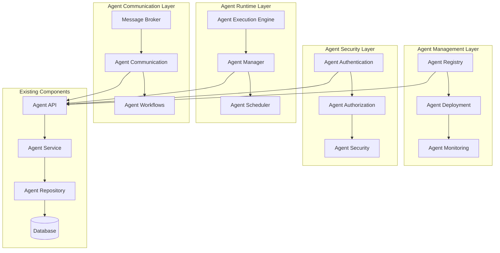

# DevCycle Agent System Architecture

## Overview

This document defines the comprehensive architecture for the DevCycle AI Agent System, addressing the current gaps and providing a scalable, maintainable foundation for agent-based development lifecycle automation.

## Current State Analysis

### ✅ Existing Components
- **Base Agent Framework**: Abstract base classes and execution lifecycle
- **Database Models**: Complete agent and task persistence layer
- **Service Layer**: Business logic for agent management
- **API Layer**: RESTful endpoints for agent operations
- **Repository Pattern**: Data access abstraction

### ❌ Missing Components
- **Agent Execution Engine**: Runtime for executing agent logic
- **Agent Communication**: Inter-agent messaging and coordination
- **Agent Orchestration**: Workflow management and task distribution
- **Agent Deployment**: Containerization and scaling strategy
- **Agent Monitoring**: Comprehensive observability and metrics
- **Agent Security**: Authentication and authorization framework
- **Agent Versioning**: Update and rollback management

## Architecture Design

### 1. Agent System Components



### 2. Agent Lifecycle Management

#### Agent States
```
REGISTERED → DEPLOYING → ONLINE → BUSY → IDLE → OFFLINE → ERROR → MAINTENANCE
     ↓           ↓         ↓       ↓      ↓       ↓        ↓         ↓
   [PENDING]  [STARTING] [READY] [WORKING] [WAITING] [STOPPED] [FAILED] [UPDATING]
```

#### Lifecycle Operations
- **Registration**: Agent registers with system, provides capabilities
- **Deployment**: Agent container/image deployed to runtime environment
- **Activation**: Agent becomes available for task assignment
- **Execution**: Agent processes tasks and reports status
- **Health Monitoring**: Continuous health checks and heartbeat processing
- **Scaling**: Dynamic scaling based on workload
- **Updates**: Rolling updates with zero-downtime deployment
- **Decommissioning**: Graceful shutdown and cleanup

### 3. Agent Communication Patterns

#### Message Types
- **Command Messages**: Direct task assignments
- **Event Messages**: Status updates and notifications
- **Request-Response**: Synchronous communication
- **Broadcast**: System-wide announcements
- **Workflow Messages**: Multi-agent coordination

#### Communication Channels
- **Direct**: Point-to-point communication
- **Pub/Sub**: Event-driven messaging
- **Queue**: Asynchronous task processing
- **WebSocket**: Real-time bidirectional communication

### 4. Agent Execution Engine

#### Core Components
- **Agent Runtime**: Containerized execution environment
- **Task Scheduler**: Intelligent task distribution
- **Resource Manager**: CPU, memory, and I/O management
- **Execution Monitor**: Real-time execution tracking
- **Error Handler**: Fault tolerance and recovery

#### Execution Models
- **Synchronous**: Blocking execution with immediate results
- **Asynchronous**: Non-blocking execution with callbacks
- **Batch**: Bulk processing of multiple tasks
- **Streaming**: Continuous data processing
- **Distributed**: Multi-node execution coordination

### 5. Agent Security Framework

#### Authentication
- **Agent Identity**: Unique agent certificates and keys
- **API Authentication**: JWT tokens and API keys
- **Mutual TLS**: Encrypted communication channels
- **OAuth2**: Third-party integration authentication

#### Authorization
- **Role-Based Access Control (RBAC)**: Agent permission management
- **Resource-Based Permissions**: Fine-grained access control
- **Network Policies**: Network-level security rules
- **Audit Logging**: Comprehensive security event tracking

### 6. Agent Monitoring and Observability

#### Metrics
- **Performance Metrics**: Execution time, throughput, latency
- **Resource Metrics**: CPU, memory, disk, network usage
- **Business Metrics**: Task success rate, error rate, availability
- **Custom Metrics**: Agent-specific performance indicators

#### Logging
- **Structured Logging**: JSON-formatted logs with correlation IDs
- **Log Aggregation**: Centralized log collection and analysis
- **Log Levels**: Configurable logging verbosity
- **Log Retention**: Automated log lifecycle management

#### Tracing
- **Distributed Tracing**: End-to-end request tracing
- **Span Correlation**: Cross-service operation tracking
- **Performance Analysis**: Bottleneck identification
- **Dependency Mapping**: Service relationship visualization

### 7. Agent Deployment Strategy

#### Containerization
- **Docker Images**: Standardized agent packaging
- **Multi-stage Builds**: Optimized image sizes
- **Base Images**: Common runtime environments
- **Image Registry**: Centralized image storage and distribution

#### Orchestration
- **Kubernetes**: Container orchestration and management
- **Helm Charts**: Deployment configuration management
- **Auto-scaling**: Dynamic resource allocation
- **Rolling Updates**: Zero-downtime deployments

#### Environment Management
- **Development**: Local development and testing
- **Staging**: Pre-production validation
- **Production**: Live system deployment
- **Disaster Recovery**: Backup and recovery procedures

## Implementation Plan

### Phase 1: Core Infrastructure (Weeks 1-2)
1. **Agent Execution Engine**
   - Container runtime implementation
   - Task scheduling and distribution
   - Resource management and monitoring

2. **Agent Communication Layer**
   - Message broker integration (Redis/RabbitMQ)
   - Communication protocol definition
   - Basic messaging implementation

### Phase 2: Management and Security (Weeks 3-4)
1. **Agent Registry and Deployment**
   - Agent registration and discovery
   - Deployment automation
   - Version management

2. **Security Framework**
   - Authentication and authorization
   - Network security policies
   - Audit logging

### Phase 3: Monitoring and Operations (Weeks 5-6)
1. **Comprehensive Monitoring**
   - Metrics collection and visualization
   - Alerting and notification systems
   - Performance analysis tools

2. **Operational Tools**
   - Agent management dashboard
   - Debugging and troubleshooting tools
   - Backup and recovery procedures

### Phase 4: Advanced Features (Weeks 7-8)
1. **Agent Orchestration**
   - Workflow management
   - Multi-agent coordination
   - Complex task distribution

2. **Advanced Security**
   - Zero-trust security model
   - Advanced threat detection
   - Compliance and governance

## Technical Specifications

### Technology Stack
- **Runtime**: Python 3.12+ with asyncio
- **Containerization**: Docker with multi-stage builds
- **Orchestration**: Kubernetes with Helm
- **Message Broker**: Redis Streams or Apache Kafka
- **Database**: PostgreSQL with connection pooling
- **Monitoring**: Prometheus + Grafana
- **Logging**: ELK Stack (Elasticsearch, Logstash, Kibana)
- **Tracing**: Jaeger or Zipkin

### Performance Requirements
- **Latency**: < 100ms for task assignment
- **Throughput**: 1000+ concurrent agent executions
- **Availability**: 99.9% uptime SLA
- **Scalability**: Horizontal scaling to 100+ agent instances

### Security Requirements
- **Encryption**: TLS 1.3 for all communications
- **Authentication**: Multi-factor authentication support
- **Authorization**: Fine-grained permission control
- **Audit**: Complete audit trail for all operations
- **Compliance**: SOC 2 Type II compliance ready

## Migration Strategy

### Existing System Integration
1. **Preserve Current API**: Maintain backward compatibility
2. **Gradual Migration**: Phase-by-phase implementation
3. **Feature Flags**: Toggle new functionality
4. **Rollback Plan**: Quick reversion capability

### Data Migration
1. **Database Schema**: Extend existing models
2. **Configuration Migration**: Convert existing configs
3. **Agent Registration**: Migrate existing agents
4. **Task History**: Preserve execution history

## Success Criteria

### Functional Requirements
- ✅ Agents can register and discover each other
- ✅ Tasks can be distributed and executed efficiently
- ✅ Agents can communicate and coordinate workflows
- ✅ System can scale to handle increased load
- ✅ Comprehensive monitoring and observability

### Non-Functional Requirements
- ✅ High availability and fault tolerance
- ✅ Secure communication and access control
- ✅ Performance meets specified requirements
- ✅ Easy deployment and maintenance
- ✅ Comprehensive documentation and testing

## Risk Assessment

### High Risk
- **Complexity**: System complexity may impact maintainability
- **Performance**: Distributed system performance challenges
- **Security**: Multi-tenant security considerations

### Medium Risk
- **Integration**: Integration with existing systems
- **Testing**: Comprehensive testing of distributed system
- **Documentation**: Keeping documentation current

### Mitigation Strategies
- **Incremental Development**: Build and test incrementally
- **Comprehensive Testing**: Automated testing at all levels
- **Documentation**: Living documentation with examples
- **Monitoring**: Proactive monitoring and alerting
- **Training**: Team training on new architecture

## Conclusion

This architecture provides a comprehensive foundation for the DevCycle Agent System, addressing current gaps while maintaining compatibility with existing components. The phased implementation approach minimizes risk while delivering incremental value.

The system is designed to be scalable, secure, and maintainable, providing a solid foundation for future agent-based development lifecycle automation.
