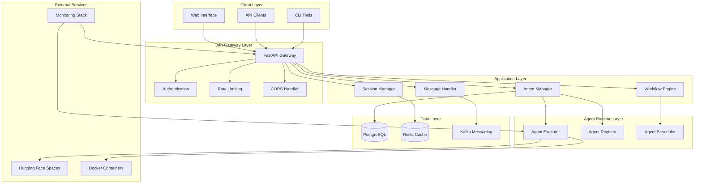
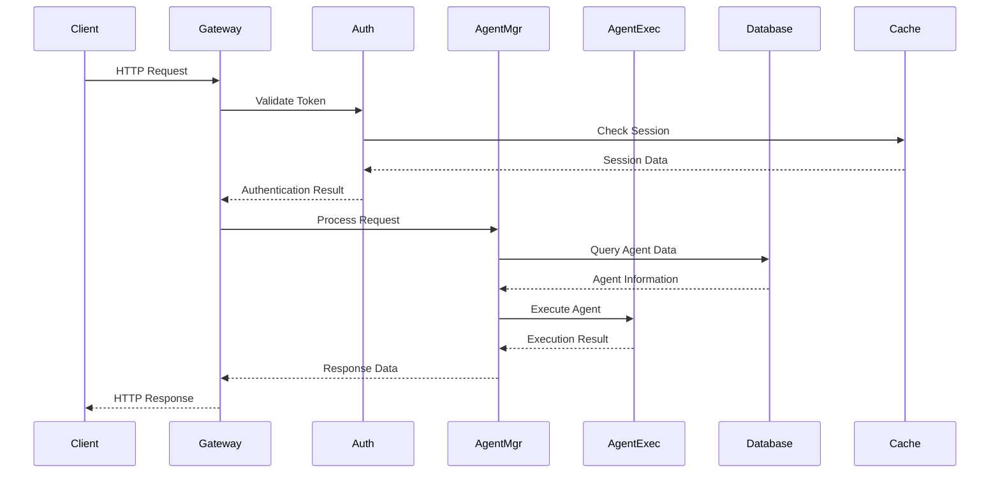
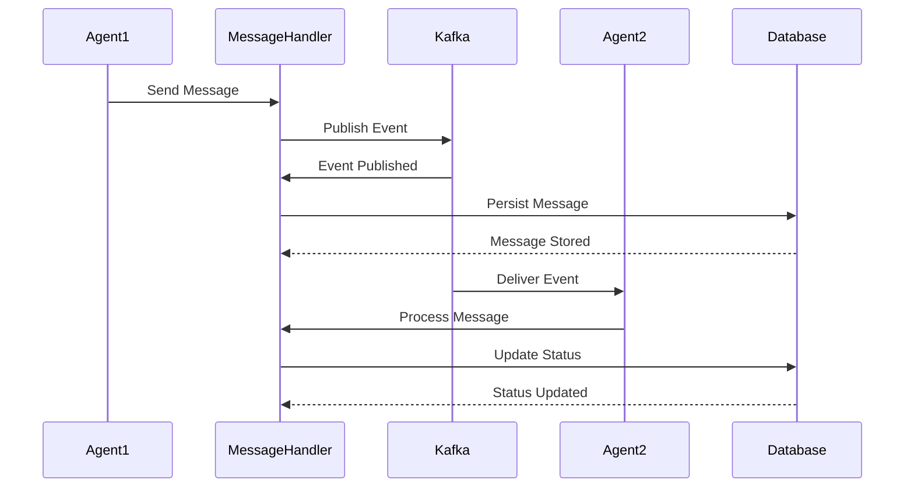
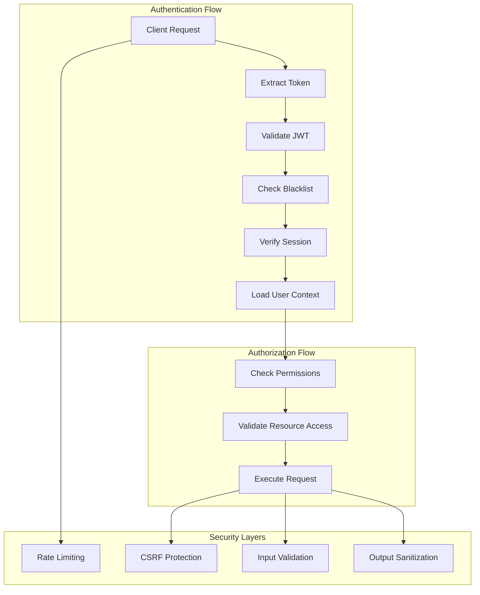
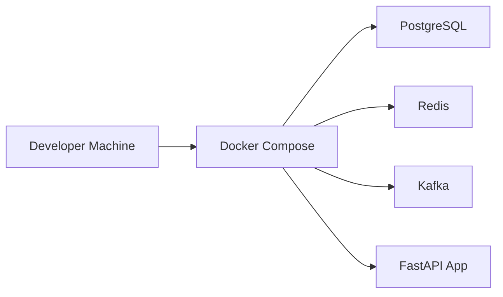
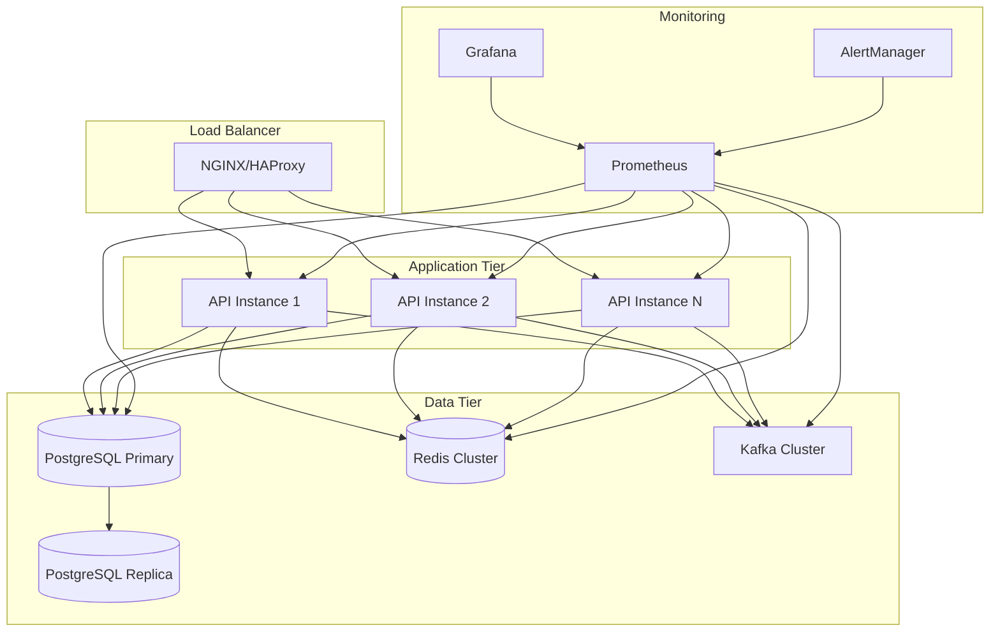

# Architecture Overview

This document provides a comprehensive overview of the DevCycle system architecture, including design principles, component relationships, and architectural decisions. For detailed agent system architecture, see the [Agent System Architecture](agent-system.md) document.

## System Architecture

DevCycle follows a **layered, microservices-oriented architecture** designed for scalability, maintainability, and extensibility. The system is built around the concept of AI agents that collaborate to automate software development lifecycle processes, as outlined in our [project structure](../getting-started/project-structure.md).

### High-Level Architecture

## Design Principles

### 1. **Separation of Concerns**
Each layer has distinct responsibilities:
- **Client Layer**: User interfaces and API consumers
- **API Gateway**: Request routing, authentication, and rate limiting
- **Application Layer**: Business logic and orchestration
- **Agent Runtime**: Agent execution and management
- **Data Layer**: Data persistence and caching
- **External Services**: Third-party integrations

### 2. **Microservices Architecture**
- **Modular Components**: Each service has a single responsibility
- **Loose Coupling**: Services communicate through well-defined APIs
- **Independent Deployment**: Services can be deployed and scaled independently
- **Fault Isolation**: Failures in one service don't cascade to others

### 3. **Event-Driven Communication**
- **Asynchronous Messaging**: Kafka-based event streaming
- **Event Sourcing**: State changes are captured as events
- **CQRS Pattern**: Separate read and write models
- **Eventual Consistency**: System maintains consistency over time

### 4. **Security by Design**
- **Zero Trust Architecture**: No implicit trust between components
- **Defense in Depth**: Multiple security layers
- **Principle of Least Privilege**: Minimal required permissions
- **Security Monitoring**: Continuous security assessment

## Core Components

### API Gateway Layer

The API Gateway serves as the single entry point for all client requests:

- **FastAPI Application**: High-performance async web framework
- **Authentication**: JWT-based authentication with token blacklisting
- **Authorization**: Role-based access control (RBAC)
- **Rate Limiting**: Request throttling and abuse prevention
- **CORS Handling**: Cross-origin resource sharing configuration
- **Request/Response Logging**: Comprehensive audit trail

### Application Layer

The application layer contains the core business logic:

#### **Agent Manager**
- Agent lifecycle management (create, update, delete, deploy)
- Agent configuration and metadata management
- Agent health monitoring and status tracking
- Agent versioning and rollback capabilities

#### **Workflow Engine**
- Workflow definition and execution
- Task orchestration and dependency management
- Error handling and retry logic
- Workflow state persistence

#### **Message Handler**
- Inter-agent communication
- Message routing and delivery
- Message persistence and replay
- Dead letter queue handling

#### **Session Manager**
- User session management
- Session state persistence
- Session timeout and cleanup
- Multi-device session handling

### Agent Runtime Layer

The agent runtime provides the execution environment for AI agents:

#### **Agent Executor**
- Agent code execution in isolated environments
- Resource management and limits
- Execution monitoring and metrics
- Error handling and recovery

#### **Agent Registry**
- Agent metadata and configuration storage
- Agent discovery and lookup
- Agent dependency management
- Agent compatibility checking

#### **Agent Scheduler**
- Task scheduling and prioritization
- Resource allocation and load balancing
- Execution queue management
- Performance optimization

### Data Layer

The data layer provides persistence and caching:

#### **PostgreSQL Database**
- Primary data storage for structured data
- ACID compliance for critical operations
- Full-text search capabilities
- Backup and recovery mechanisms

#### **Redis Cache**
- Session storage and management
- Application-level caching
- Rate limiting counters
- Pub/Sub messaging

#### **Kafka Messaging**
- Event streaming and message queuing
- Inter-service communication
- Event sourcing and replay
- Dead letter queue management

## Data Flow Architecture

### Request Flow

### Event Flow

## Security Architecture

### Authentication & Authorization

### Security Measures

1. **Authentication**
   - JWT tokens with short expiration
   - Token blacklisting for immediate revocation
   - Multi-factor authentication support
   - Session management with Redis

2. **Authorization**
   - Role-based access control (RBAC)
   - Resource-level permissions
   - API endpoint protection
   - Agent execution permissions

3. **Data Protection**
   - Encryption at rest and in transit
   - Input validation and sanitization
   - SQL injection prevention
   - XSS protection

4. **Infrastructure Security**
   - Container isolation
   - Network segmentation
   - Security headers
   - Vulnerability scanning

## Scalability Considerations

### Horizontal Scaling

- **Stateless Services**: All services are stateless for easy scaling
- **Load Balancing**: Multiple instances behind load balancers
- **Database Sharding**: Horizontal partitioning for large datasets
- **Cache Distribution**: Redis cluster for high availability

### Performance Optimization

- **Connection Pooling**: Database connection optimization
- **Caching Strategy**: Multi-level caching (application, database, CDN)
- **Async Processing**: Non-blocking I/O operations
- **Resource Monitoring**: Continuous performance monitoring

### Fault Tolerance

- **Circuit Breakers**: Prevent cascade failures
- **Retry Logic**: Automatic retry with exponential backoff
- **Health Checks**: Service health monitoring
- **Graceful Degradation**: Fallback mechanisms

## Technology Stack

The DevCycle technology stack is designed to support our multi-agent architecture and automated workflows:

### Backend Technologies
- **FastAPI**: High-performance async web framework for the API gateway
- **SQLAlchemy**: Python ORM for database operations and data modeling
- **Alembic**: Database migration management and version control
- **Pydantic**: Data validation and serialization for type safety
- **Poetry**: Dependency management and packaging

### Data & Storage Technologies
- **PostgreSQL**: Primary relational database for structured data
- **Redis**: Caching layer, session storage, and rate limiting
- **Kafka**: Event streaming and inter-agent messaging
- **Alembic**: Database schema migrations and versioning

### AI/ML Technologies
- **Hugging Face**: Pre-trained models and agent deployment spaces
- **Transformers**: NLP model library for AI agent capabilities
- **PyTorch**: Deep learning framework for custom agent models
- **Custom Agents**: Specialized AI agents for different development roles

### Infrastructure & Development
- **Docker**: Containerization for consistent deployment
- **Docker Compose**: Local development orchestration
- **Poetry**: Python dependency management
- **Black, Flake8, MyPy**: Code quality and type checking
- **Pytest**: Testing framework with TestContainers

## Deployment Architecture

### Development Environment

### Production Environment (Future)

## Next Steps

- **[System Diagrams](system-diagrams.md)** - Comprehensive visual architecture diagrams
- **[Agent System Architecture](agent-system.md)** - Detailed agent system design and implementation
- **[Security Architecture](security.md)** - Comprehensive security design and measures
- **[Project Structure](../getting-started/project-structure.md)** - Codebase organization and design principles
- **[API Documentation](../api/overview.md)** - REST API specifications and usage
- **[Getting Started Guide](../getting-started/quick-start.md)** - Set up your development environment
- **[Development Guidelines](../development/guidelines.md)** - Development practices and standards
- **[Operations Guide](../operations/configuration.md)** - Deployment and operations procedures
