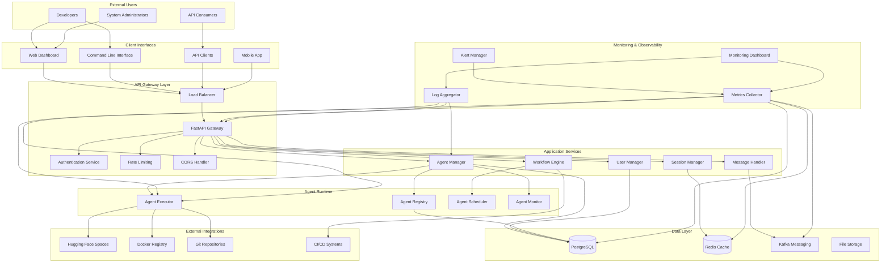
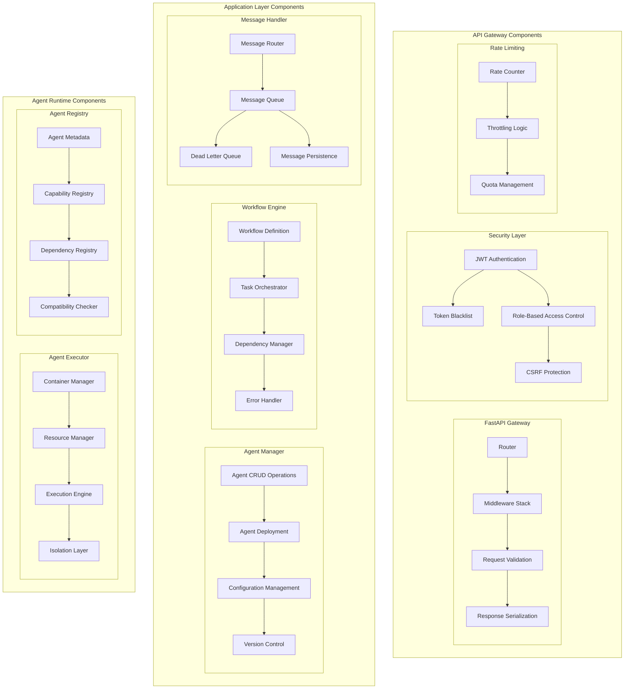
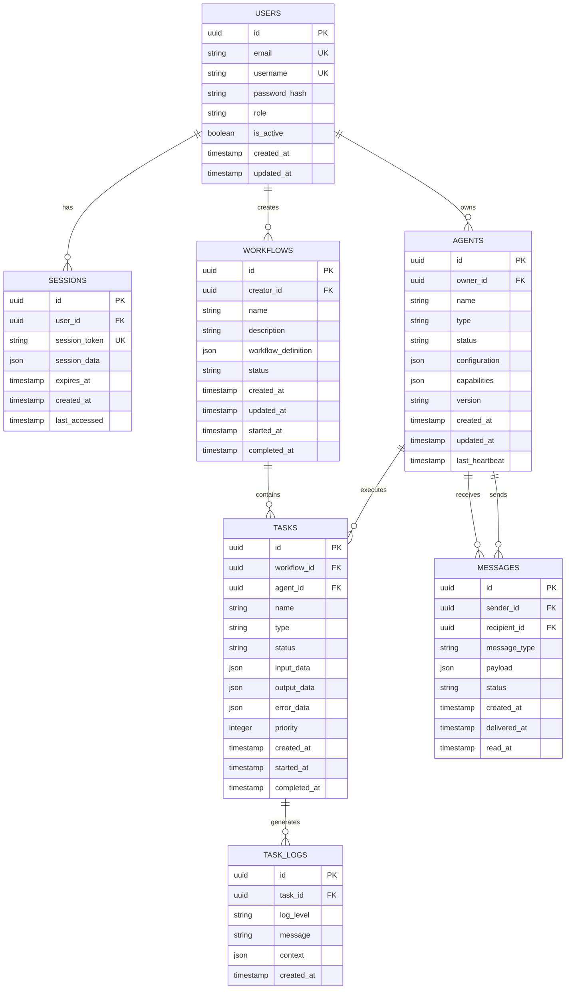
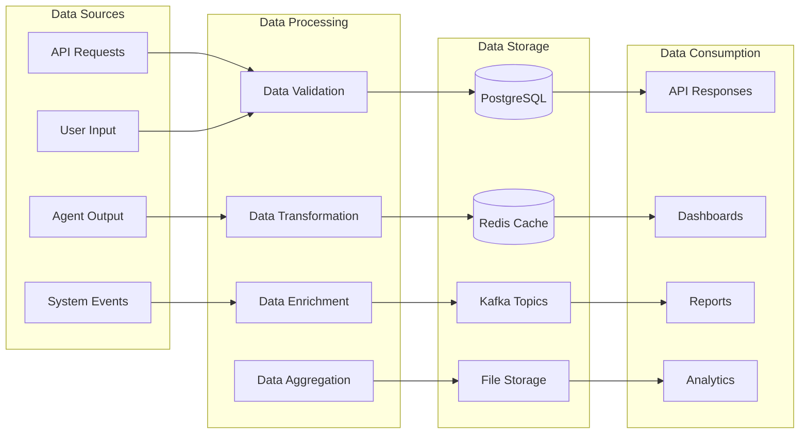
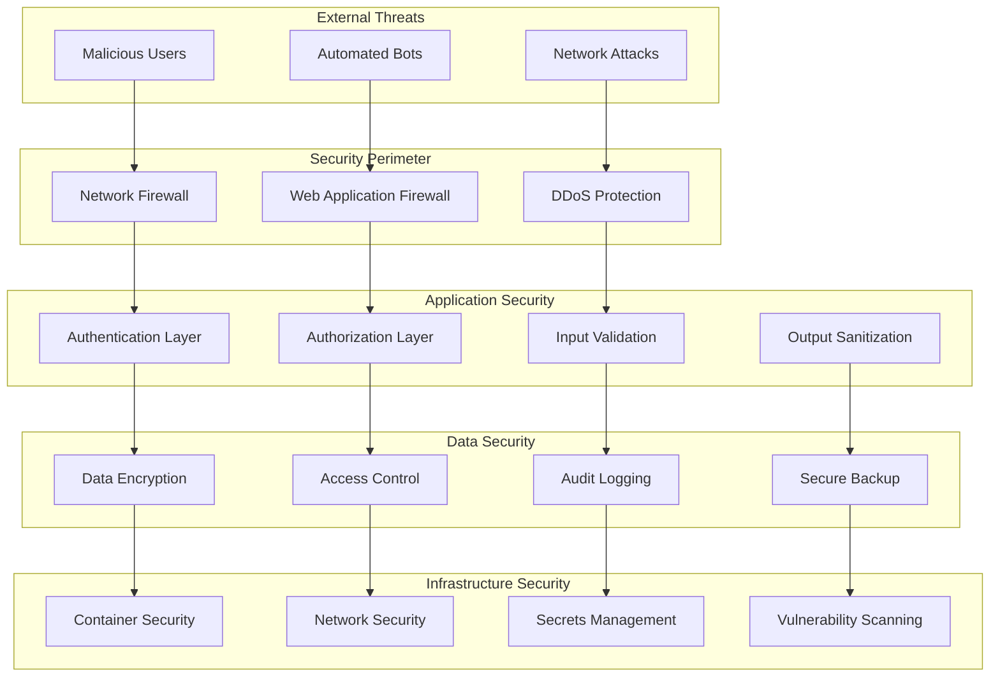
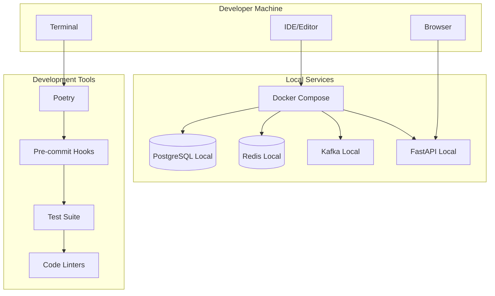
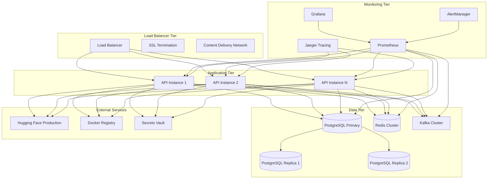
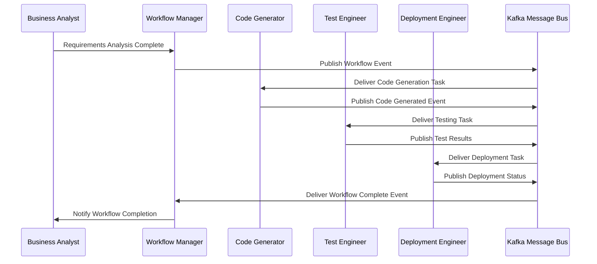

# System Architecture Diagrams

This document contains comprehensive system architecture diagrams for the DevCycle platform, providing visual representations of the system's structure, data flow, and component interactions.

## System Overview

### High-Level System Architecture

## Component Architecture

### Detailed Component View

## Data Architecture

### Database Schema Overview

### Data Flow Architecture

## Security Architecture

### Security Layer Diagram

## Deployment Architecture

### Development Environment

### Production Environment (Future)

## Agent Communication Patterns

### Inter-Agent Communication

## Next Steps

- **[Architecture Overview](overview.md)** - Return to main architecture overview
- **[Agent System Architecture](agent-system.md)** - Detailed agent system design
- **[Security Architecture](security.md)** - Comprehensive security design
- **[Project Structure](../getting-started/project-structure.md)** - Codebase organization
