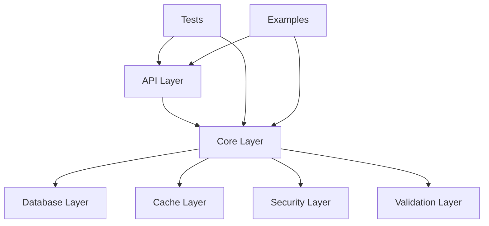

# Project Structure

This document explains the organization and structure of the DevCycle project codebase.

## Overview

DevCycle follows a modular, layered architecture with clear separation of concerns. The project is organized into logical components that handle different aspects of the AI agent system.

## Root Directory Structure

```
DevCycle/
├── devcycle/                 # Main application package
├── tests/                    # Test suite
├── docs/                     # Documentation
├── config/                   # Environment configurations
├── scripts/                  # Utility scripts
├── alembic/                  # Database migrations
├── examples/                 # Usage examples
├── agents/                   # Agent specifications
├── docker-compose.yml        # Container orchestration
├── pyproject.toml           # Project configuration
├── poetry.lock              # Dependency lock file
├── pytest.ini              # Test configuration
├── mypy.ini                 # Type checking configuration
└── README.md                # Project overview
```

## Core Application Structure

### `devcycle/` - Main Application Package

```
devcycle/
├── __init__.py              # Package initialization
├── api/                     # FastAPI application layer
│   ├── app.py              # Main FastAPI application
│   ├── middleware/         # Custom middleware
│   ├── auth/               # Authentication endpoints
│   ├── agents/             # Agent management endpoints
│   ├── messages/           # Message handling endpoints
│   └── health/             # Health check endpoints
├── core/                    # Core business logic
│   ├── auth/               # Authentication & authorization
│   ├── agents/             # Agent management
│   ├── cache/              # Caching layer
│   ├── config/             # Configuration management
│   ├── database/           # Database layer
│   ├── logging/            # Logging configuration
│   ├── messaging/          # Message handling
│   ├── security/           # Security utilities
│   ├── validation/         # Input validation
│   └── exceptions/         # Custom exceptions
├── huggingface/            # Hugging Face integration
└── utils/                  # Utility functions
```

### `api/` - API Layer

The API layer handles HTTP requests and responses using FastAPI:

- **`app.py`**: Main FastAPI application with middleware and route registration
- **`middleware/`**: Custom middleware for security, logging, and request processing
- **`auth/`**: Authentication and authorization endpoints
- **`agents/`**: Agent management and orchestration endpoints
- **`messages/`**: Message handling and communication endpoints
- **`health/`**: System health monitoring endpoints

### `core/` - Business Logic Layer

The core layer contains the main business logic and domain models:

#### **Authentication (`core/auth/`)**
- **`fastapi_users.py`**: FastAPI Users integration
- **`models.py`**: User and session models
- **`password.py`**: Password hashing and validation
- **`secure_jwt_strategy.py`**: Enhanced JWT strategy with security features
- **`token_blacklist.py`**: Token revocation and blacklisting
- **`session_monitor.py`**: Session monitoring and management

#### **Agent Management (`core/agents/`)**
- **`base.py`**: Abstract base agent class
- **`business_analyst.py`**: Business analyst agent implementation
- **`models.py`**: Agent data models
- **`service.py`**: Agent business logic
- **`repository.py`**: Agent data access layer

#### **Database Layer (`core/database/`)**
- **`connection.py`**: Database connection management
- **`models.py`**: SQLAlchemy models
- **`session.py`**: Database session management
- **`migrations/`**: Database migration scripts

#### **Caching (`core/cache/`)**
- **`redis_cache.py`**: Redis caching implementation
- **`interface.py`**: Caching interface definitions

#### **Configuration (`core/config/`)**
- **`settings.py`**: Application settings and configuration
- **`environment.py`**: Environment-specific configurations

#### **Security (`core/security/`)**
- **`csrf.py`**: CSRF protection
- **`headers.py`**: Security headers middleware
- **`rate_limiting.py`**: Rate limiting implementation

#### **Validation (`core/validation/`)**
- **`input.py`**: Input validation and sanitization
- **`schemas.py`**: Pydantic schemas for data validation

## Test Structure

### `tests/` - Test Suite

```
tests/
├── unit/                    # Unit tests
│   ├── test_auth.py        # Authentication tests
│   ├── test_agents.py      # Agent tests
│   ├── test_api.py         # API endpoint tests
│   ├── test_security.py    # Security tests
│   └── test_validation.py  # Validation tests
├── integration/             # Integration tests
│   ├── test_database.py    # Database integration tests
│   ├── test_redis.py       # Redis integration tests
│   └── test_kafka.py       # Kafka integration tests
├── e2e/                     # End-to-end tests
│   ├── test_workflows.py   # Complete workflow tests
│   └── test_user_journeys.py # User journey tests
├── conftest.py             # Test configuration
└── conftest_testcontainers.py # TestContainers setup
```

## Configuration Files

### Environment Configuration (`config/`)
- **`development.env`**: Development environment settings
- **`production.env`**: Production environment settings
- **`testing.env`**: Testing environment settings

### Project Configuration
- **`pyproject.toml`**: Poetry project configuration, dependencies, and metadata
- **`poetry.lock`**: Locked dependency versions
- **`pytest.ini`**: Pytest configuration
- **`mypy.ini`**: MyPy type checking configuration
- **`docker-compose.yml`**: Container orchestration

## Database Migrations (`alembic/`)

```
alembic/
├── env.py                  # Alembic environment configuration
├── script.py.mako         # Migration template
└── versions/              # Migration files
    └── 001_fastapi_users_schema.py
```

## Documentation (`docs/`)

```
docs/
├── index.md               # Main documentation page
├── getting-started/       # Getting started guides
├── architecture/          # Architecture documentation
├── api/                   # API documentation
├── development/           # Development guides
├── operations/            # Operations guides
└── contributing/          # Contribution guidelines
```

## Examples (`examples/`)

```
examples/
├── api_client_demo.py     # API client usage examples
├── business_analyst_demo.py # Agent usage examples
├── kafka_messaging_demo.py # Kafka messaging examples
├── redis_caching_demo.py  # Redis caching examples
└── README.md              # Examples overview
```

## Agent Specifications (`agents/`)

```
agents/
├── codegen/               # Code generation agent specs
├── deployment/            # Deployment agent specs
├── requirements/          # Requirements analysis agent specs
└── testing/               # Testing agent specs
```

## Scripts (`scripts/`)

```
scripts/
├── start-database.bat     # Windows database startup
├── start-database.sh      # Linux/macOS database startup
├── start-kafka.bat        # Windows Kafka startup
├── start-kafka.sh         # Linux/macOS Kafka startup
└── init-db.sql            # Database initialization
```

## Key Design Principles

### 1. **Separation of Concerns**
- API layer handles HTTP concerns
- Core layer handles business logic
- Database layer handles data persistence
- Each layer has clear responsibilities

### 2. **Dependency Injection**
- Services are injected rather than instantiated directly
- Enables easy testing and configuration
- Promotes loose coupling

### 3. **Repository Pattern**
- Data access is abstracted through repositories
- Business logic doesn't depend on specific database implementations
- Enables easy testing with mock repositories

### 4. **Configuration Management**
- Environment-specific configurations
- Centralized settings management
- Type-safe configuration with Pydantic

### 5. **Security by Design**
- Security measures integrated at multiple layers
- Input validation and sanitization
- Authentication and authorization
- CSRF protection and security headers

## Module Dependencies



## File Naming Conventions

- **Python files**: `snake_case.py`
- **Classes**: `PascalCase`
- **Functions/Variables**: `snake_case`
- **Constants**: `UPPER_CASE`
- **Configuration files**: `kebab-case` or `snake_case`
- **Documentation**: `kebab-case.md`

## Import Organization

Python imports are organized in the following order:
1. **Standard library imports**
2. **Third-party imports**
3. **Local application imports**

Each group is separated by a blank line.

## Next Steps

- **[Getting Started Guide](quick-start.md)** - Set up your development environment
- **[Installation Guide](installation.md)** - Detailed installation instructions
- **[API Documentation](../api/overview.md)** - Explore the REST API
- **[Architecture Overview](../architecture/overview.md)** - Understand the system design
- **[Development Guidelines](../development/guidelines.md)** - Learn development practices
